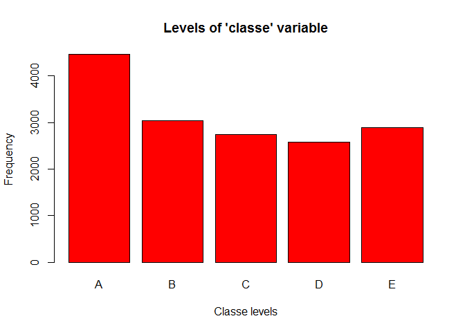
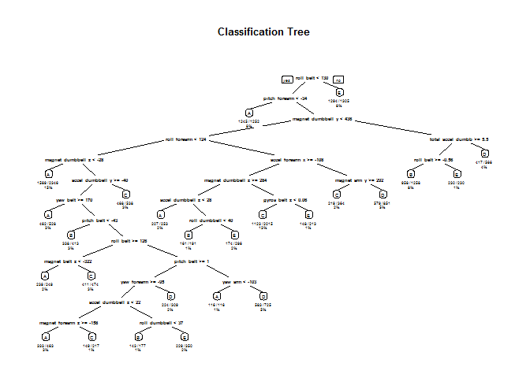

# Practical Machine Learning Project
        
## Author: Manuel Meretto (August 2015)

### Overview

Using devices such as Jawbone Up, Nike FuelBand, and Fitbit it is now possible to collect a large amount of data about personal activity relatively inexpensively. The goal of the project is to use data from accelerometers on the belt, forearm, arm, and dumbell of 6 participants to predict the manner in which they did the exercise ("classe" variable in the dataset) using any of the variables. The output should be a report describing how you built the model, how you used cross validation, what you think the expected out of sample error is, and why you made the choices you did. The prediction model will then be used to predict 20 different test cases.
        
### Packages and Data Loading

We load all packages required for the analysis and set the seed to support reproducibility:


```r
library(caret)
```

```
## Warning: package 'caret' was built under R version 3.2.1
```

```
## Loading required package: lattice
## Loading required package: ggplot2
```

```
## Warning: package 'ggplot2' was built under R version 3.2.1
```

```r
library(rpart)
```

```
## Warning: package 'rpart' was built under R version 3.2.1
```

```r
library(rpart.plot)
```

```
## Warning: package 'rpart.plot' was built under R version 3.2.1
```

```r
library(randomForest)
```

```
## Warning: package 'randomForest' was built under R version 3.2.1
```

```
## randomForest 4.6-10
## Type rfNews() to see new features/changes/bug fixes.
```

```r
set.seed(1357)
```

We then load the data, manage missing values and delete irrelevant variables:


```r
training <- read.csv('pml-training.csv', na.strings = c("NA", "#DIV/0!", ""))
testing <- read.csv('pml-testing.csv', na.strings = c("NA", "#DIV/0!", ""))
```

### Preprocessing


```r
training <- training[, colSums(is.na(training)) == 0]
testing <- testing[, colSums(is.na(testing)) == 0]

training <- training[,-c(1:7)]
testing <- testing[,-c(1:7)]
```

We split the training data into subTraining (80% of the training set) and subTesting (20% of the training set):


```r
subsamples <- createDataPartition(y = training$classe, p = 0.80, list = FALSE)
subTraining <- training[subsamples, ] 
subTesting <- training[-subsamples, ]
```

### Exploratory Analysis

We plot the variable "classe" to see the frequency of each of the 5 levels in the subTraining dataset:


```r
plot(subTraining$classe, col="red", main="Levels of 'classe' variable", xlab = "Classe levels", ylab = "Frequency")
```

 

We can see from the plot that while level A is the most frequent level (with more than 4000 occurrences), level D is the least frequent (with about 2500 occurrences).

### Prediction with Decision Tree


```r
decisionTreeModel <- rpart(classe ~ ., data=subTraining, method = "class")
decisionTreePrediction <- predict(decisionTreeModel, subTesting, type = "class")
rpart.plot(decisionTreeModel, main="Classification Tree", extra = 102, under = TRUE, faclen = 0)
```

 

```r
confusionMatrix(decisionTreePrediction, subTesting$classe)
```

```
## Confusion Matrix and Statistics
## 
##           Reference
## Prediction    A    B    C    D    E
##          A 1037  151   16   77   15
##          B   22  390   42   16   37
##          C   29  143  567   81   90
##          D   16   50   58  421   52
##          E   12   25    1   48  527
## 
## Overall Statistics
##                                           
##                Accuracy : 0.7499          
##                  95% CI : (0.7361, 0.7634)
##     No Information Rate : 0.2845          
##     P-Value [Acc > NIR] : < 2.2e-16       
##                                           
##                   Kappa : 0.6822          
##  Mcnemar's Test P-Value : < 2.2e-16       
## 
## Statistics by Class:
## 
##                      Class: A Class: B Class: C Class: D Class: E
## Sensitivity            0.9292  0.51383   0.8289   0.6547   0.7309
## Specificity            0.9077  0.96302   0.8941   0.9463   0.9731
## Pos Pred Value         0.8002  0.76923   0.6231   0.7052   0.8597
## Neg Pred Value         0.9699  0.89198   0.9612   0.9333   0.9414
## Prevalence             0.2845  0.19347   0.1744   0.1639   0.1838
## Detection Rate         0.2643  0.09941   0.1445   0.1073   0.1343
## Detection Prevalence   0.3304  0.12924   0.2320   0.1522   0.1563
## Balanced Accuracy      0.9185  0.73843   0.8615   0.8005   0.8520
```

### Prediction with Random Forest


```r
randomForestModel <- randomForest(classe ~ ., data = subTraining, method = "class")
randomForestPrediction <- predict(randomForestModel, subTesting, type = "class")
confusionMatrix(randomForestPrediction, subTesting$classe)
```

```
## Confusion Matrix and Statistics
## 
##           Reference
## Prediction    A    B    C    D    E
##          A 1116    2    0    0    0
##          B    0  757    5    0    0
##          C    0    0  677    3    0
##          D    0    0    2  639    3
##          E    0    0    0    1  718
## 
## Overall Statistics
##                                           
##                Accuracy : 0.9959          
##                  95% CI : (0.9934, 0.9977)
##     No Information Rate : 0.2845          
##     P-Value [Acc > NIR] : < 2.2e-16       
##                                           
##                   Kappa : 0.9948          
##  Mcnemar's Test P-Value : NA              
## 
## Statistics by Class:
## 
##                      Class: A Class: B Class: C Class: D Class: E
## Sensitivity            1.0000   0.9974   0.9898   0.9938   0.9958
## Specificity            0.9993   0.9984   0.9991   0.9985   0.9997
## Pos Pred Value         0.9982   0.9934   0.9956   0.9922   0.9986
## Neg Pred Value         1.0000   0.9994   0.9978   0.9988   0.9991
## Prevalence             0.2845   0.1935   0.1744   0.1639   0.1838
## Detection Rate         0.2845   0.1930   0.1726   0.1629   0.1830
## Detection Prevalence   0.2850   0.1942   0.1733   0.1642   0.1833
## Balanced Accuracy      0.9996   0.9979   0.9944   0.9961   0.9978
```

### Conclusions

As can be seen, the Random Forest algorithm overperformed the Decision Tree algorithm. In particular the accuracy for Random Forest model was 0.996 while the accuracy for Decision Tree was 0.750. That is why we choose the random Forest model. We expect an out-of-sample error of 0.4%.
